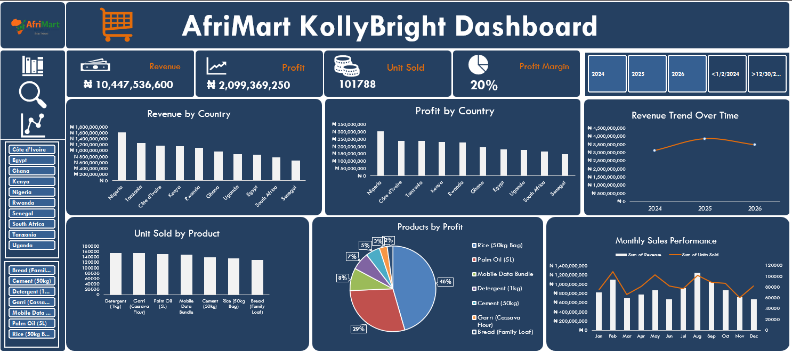

# AfriMart Sales Analysis: Product & Country Performance Across Africa

## 📊 Project Overview

This project analyzes AfriMart sales data from **2024 to 2026** to identify sales patterns across different products and African countries.

The analysis focuses on understanding:

* Which products generate the most revenue
* Which countries contribute the most to overall sales
* How product performance varies across countries
* Revenue and profit trends over time
* Which products have the highest profit margins
* Opportunities for product diversification and cross-selling
* Potential data quality issues that may affect business decisions

The project was developed as a **business-focused data analytics portfolio project**, demonstrating the use of data cleaning, exploratory analysis, KPI development, visualization, and business recommendations.

---

## 🎯 Business Problem

AfriMart operates across multiple African markets and sells a variety of consumer products.

The marketing team needs to understand:

> **What products and countries are driving AfriMart's sales, and where are there opportunities to improve revenue and profitability?**

The analysis provides insights that can help the marketing team make more informed decisions about:

* Product promotion
* Country-specific marketing campaigns
* Customer acquisition
* Cross-selling
* Product diversification
* Revenue growth
* Profitability

---

## 🗂️ Dataset

The dataset contains AfriMart transaction-level sales information covering the period **2024–2026**.

### Dataset Summary

| Metric                |             Value |
| --------------------- |         --------: |
| Period                |         2024–2026 |
| Transactions          |               701 |
| Countries             |                10 |
| Products              |                 7 |
| Total Units Sold      |         1,017,885 |
| Total Revenue         |  ₦ 10,447,536,600 |
| Total Profit          |   ₦ 2,099,369,250 |
| Overall Profit Margin |               20% |

---

## 🛠️ Tools & Technologies

The project uses the following tools:

* **Microsoft Excel** – Data cleaning, transformation, analysis and initial exploration
* **Pivot Tables** – Exploration of data
* **Pivot Charts** – Creating interactive visualization
* **Excel Slicers** – Filtering the dashboard
* **Dashboard design techniques** – Dashboard development and interactive visualization

---

## 🔍 Analytical Approach

The analysis followed these major steps:

### 1. Data Cleaning

The dataset was reviewed for:

* Missing values
* Duplicate records
* Inconsistent values
* Data types
* Country and product categories
* Date consistency

No major missing-value or duplicate-record issues were identified.

### 2. Exploratory Data Analysis

The data was analyzed by:

* Country
* Product
* Year
* Revenue
* Units sold
* Profit
* Profit margin

### 3. KPI Development

Key performance indicators included:

* Total Revenue
* Total Units Sold
* Total Profit
* Profit Margin

### 4. Dashboard Development

An interactive dashboard was designed to allow users to explore:

* Overall sales performance
* Product performance
* Country performance
* Revenue trends
* Profitability
* Product-country relationships

---

## 📈 Key Findings

*  Rice is AfriMart's dominant product
*  Nigeria generated the highest overall revenue
*  Revenue trends shows consistent growth over time
*  Products performance varies significantly by country
*  Some products recorded high sales volume but lower profit margins

---

## 💡 Business Recommendations

Based on the analysis, the following actions are recommended:

1. Strengthen rice customer acquisition

Rice is the company's largest revenue driver and should remain an important component of customer acquisition and retention campaigns.

2. Increase cross-selling

Use rice and other high-volume products as entry points for promoting higher-margin products.

3. Develop localized marketing strategies

Marketing campaigns should be adapted to individual countries based on their product demand and revenue contribution.

4. Promote higher-margin products

Products such as Mobile Data, Garri, Bread and Palm Oil have substantially higher margins than Rice and could receive increased promotional attention.

## 📊 Dashboard Preview

## 📁 Files in This Repository
- [Sales Dataset](AfriMart_Sales_Dataset.xlsx)
- [Dashboard Screenshot](AfriMart_KollyBright_Dashboard.png)
- [Company Logo](afrimart_online_logo.jpg)
- README.md
  
## 👩🏽‍💻 About the Project

This project was created as part of my Data Analytics portfolio to demonstrate practical skills in transforming raw sales data into actionable business insights.

It combines business analysis, data cleaning, exploratory analysis, KPI development, visualization and strategic recommendations.

Focus areas:
Data Analysis · Business Intelligence · Excel · SQL · Power BI · Data Visualization · Business Insights
